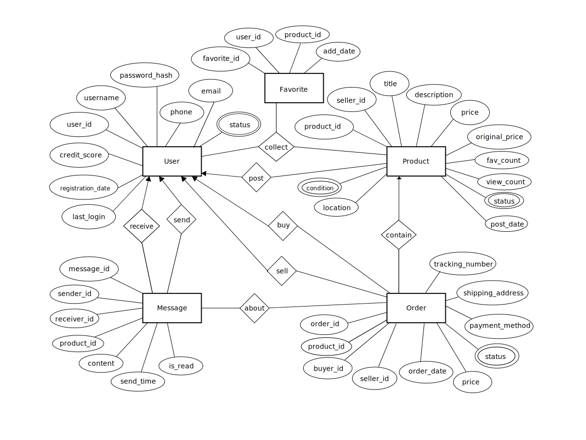

# 咸鱼数据库设计
## 核心业务需求

1. **商品交易**：用户发布二手商品信息，其他用户可以浏览、购买
2. **用户管理**：用户注册、登录、个人信息管理，用户信用
3. **消息系统**：买卖双方沟通
4. **订单管理**：交易订单的创建、支付、发货、确认收货
5. **收藏功能**：用户收藏感兴趣的商品

## 数据库实体与联系设计

### 主要实体

1. **用户(User)**
   - <u>user_id 用户ID</u>
   - username 用户名
   - password_hash 密码哈希值
   - phone 手机号
   - email 电子邮箱
   - credit_score 信用分
   - registration_date 注册日期
   - last_login 最后登录时间
   - status 状态 (active活跃/banned封禁)

2. **商品(Product)**
   - <u>product_id 商品ID</u>
   - seller_id (FK → User) 卖家ID
   - title 商品标题
   - description 商品描述
   - price 售价
   - original_price 原价
   - condition 商品状况 (new全新/like new几乎全新/good良好/fair一般/poor较差)
   - location 所在地
   - post_date 发布时间
   - status 状态 (available可售/reserved已预订/sold已售出/removed已下架)
   - view_count 浏览数
   - fav_count  收藏数量

3. **订单(Order)**
   - <u>order_id 订单ID</u>
   - product_id (FK → Product) 商品ID
   - buyer_id (FK → User) 买家ID
   - seller_id (FK → User) 卖家ID
   - order_date 订单日期
   - price 成交价格
   - status 状态 (pending待付款/paid已付款/shipped已发货/completed已完成/cancelled已取消)
   - payment_method 支付方式
   - shipping_address 收货地址
   - tracking_number 物流单号

4. **消息(Message)**
   - <u>message_id 消息ID</u>
   - sender_id (FK → User) 发送者ID
   - receiver_id (FK → User) 接收者ID
   - product_id (FK → Product, nullable) 关联商品ID（可为空）
   - content 消息内容
   - send_time 发送时间
   - is_read 是否已读

5. **收藏(Favorite)**
   - <u>favorite_id  收藏ID</u>
   - user_id (FK → User) 用户ID
   - product_id (FK → Product) 商品ID
   - add_date 收藏日期

## 主要关系

1. **用户-商品**：一对多（一个用户可以发布多个商品）
2. **用户-订单**：一对多（一个用户可以有多个订单作为买家或卖家）
3. **商品-订单**：一对一（一个商品只能对应一个有效订单）
4. **用户-消息**：一对多（一个用户可以发送/接收多条消息）
6. **用户-收藏**：多对多（通过Favorite实体实现）

## 索引设计建议

1. 用户表的username、phone、email字段建立唯一索引
2. 商品表的seller_id、category_id、status、post_date字段建立索引
3. 订单表的buyer_id、seller_id、status、order_date字段建立索引
4. 消息表的sender_id、receiver_id、send_time字段建立索引
5. 收藏表的(user_id, product_id)字段建立复合索引（可快速查询某用户是否收藏了某商品）

## 术语解释
- **FK (Foreign Key)**：外键，建立表与表之间关系的字段，指向另一表的主键
- **复合索引**：指在数据库表中对多个列组合建立的索引，可以提高多条件查询的效率。例如在收藏表中对(user_id, product_id)建立复合索引，可以快速查询"某用户是否收藏了某商品"这类操作。

## ER图

